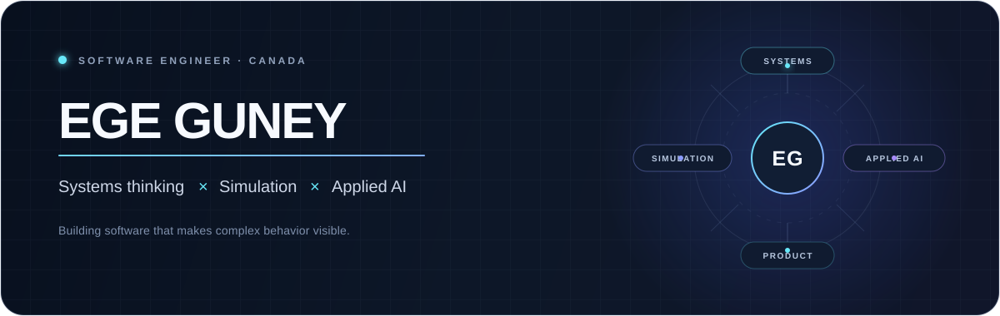

<p align="center">
  
</p>

<p align="center">
  <a href="#selected-work"><strong>Selected work</strong></a>
  &nbsp;·&nbsp;
  <a href="#engineering-range"><strong>Engineering range</strong></a>
  &nbsp;·&nbsp;
  <a href="https://www.linkedin.com/in/egeguney"><strong>LinkedIn ↗</strong></a>
</p>

---

> ### I turn technical depth into software people can see, use, and understand.

I am a software engineer in Canada working across **systems programming**, **simulation**, and **applied AI**. I am drawn to problems that require more than assembling familiar pieces: translating a game format into a live simulation, designing persistence over raw blocks, modeling custom physics, or shaping a language model into a coherent product.

The common thread is systems thinking. I like tracing how data moves, making hidden behavior observable, and building an interface that explains the engineering without flattening it.

## Selected work

<table>
  <tr>
    <td width="50%" valign="top">
      <sub>01 · APPLIED AI + PRODUCT</sub>
      <h3><a href="https://github.com/Ege-Guney/PersonaGPT-Web">Persona Studio ↗</a></h3>
      <p>A persona-conditioned conversation product built around an open-source language model.</p>
      <p><strong>Engineering signal:</strong> lazy model runtime, bounded session history, JSON APIs, responsive UI, Docker packaging, and model-free integration tests.</p>
      <p><code>Python</code> <code>Flask</code> <code>PyTorch</code> <code>Transformers</code></p>
    </td>
    <td width="50%" valign="top">
      <sub>02 · SIMULATION + DATA</sub>
      <h3><a href="https://github.com/Ege-Guney/RollerCoaster-Simulator">Roller Coaster Visualizer ↗</a></h3>
      <p>A pipeline that turns RollerCoaster Tycoon 2-style track data into a rideable Unity spline.</p>
      <p><strong>Engineering signal:</strong> parsing, coordinate translation, procedural construction, animation, and simulation-derived anticipation data.</p>
      <p><code>C#</code> <code>Unity</code> <code>Splines</code> <code>Data pipeline</code></p>
    </td>
  </tr>
  <tr>
    <td width="50%" valign="top">
      <sub>03 · SYSTEMS PROGRAMMING</sub>
      <h3><a href="https://github.com/Ege-Guney/File-System-Project">Simple File System ↗</a></h3>
      <p>A persistent single-directory file system implemented over an emulated block device.</p>
      <p><strong>Engineering signal:</strong> superblock, inodes, direct and indirect addressing, bitmap allocation, descriptors, and disk persistence.</p>
      <p><code>C</code> <code>POSIX</code> <code>Storage</code> <code>Memory management</code></p>
    </td>
    <td width="50%" valign="top">
      <sub>04 · PHYSICS + INTERACTION</sub>
      <h3><a href="https://github.com/Ege-Guney/StickFish-PhysicsEngine">StickFish Physics Engine ↗</a></h3>
      <p>A Unity experiment with custom projectile motion, collisions, lifetime rules, and deformable line-rendered bodies.</p>
      <p><strong>Engineering signal:</strong> explicit mechanics, constraint handling, procedural geometry, and collision response without hiding the logic behind a black box.</p>
      <p><code>C#</code> <code>Unity</code> <code>Physics</code> <code>Procedural geometry</code></p>
    </td>
  </tr>
</table>

## Engineering range

My repositories span different layers, but the underlying habits are consistent.

| Domain | I have built | What it exercises |
| --- | --- | --- |
| **Systems** | A file system and Unix-style shell | Resource ownership, persistence, processes, signals, memory, failure paths |
| **Simulation** | Coaster visualization and custom physics prototypes | Coordinate systems, state evolution, procedural generation, data extraction |
| **Applied AI** | Persona-conditioned chat and sentiment experiments | Model integration, inference boundaries, session state, honest evaluation |
| **Product** | Responsive React and Flask interfaces | Interaction design, accessibility, visual hierarchy, deployable packaging |

```text
I care about the whole path:

raw input  →  explicit model  →  observable behavior  →  useful interface
```

## How I work

- **Understand the system before polishing the surface.** Architecture and data flow come first.
- **Make the difficult parts visible.** Good names, focused tests, diagrams, and documentation are engineering tools.
- **Treat constraints as design material.** Performance, uncertainty, and edge cases should shape the product honestly.
- **Finish the last 10%.** Setup, failure states, accessibility, and presentation determine whether strong code earns attention.

## More projects

<details>
  <summary><strong>Open the project index</strong></summary>
  <br />

| Project | Focus |
| --- | --- |
| [Small Game Hub](https://github.com/Ege-Guney/SmallGameHub) | Four stateful browser games behind one React navigation layer |
| [Instagram UI Study](https://github.com/Ege-Guney/InstaTemplatePractice) | Pixel-focused translation of a mobile social design into React |
| [C Shell](https://github.com/Ege-Guney/Shell-Script-C) | Process creation, built-ins, background jobs, piping, signals, and redirection |
| [Sentiment Lab](https://github.com/Ege-Guney/SentimentPredictor) | A transparent comparison between a TextBlob web demo and an LSTM experiment |
| [Dynamic Floating Stones](https://github.com/Ege-Guney/Unity-Dynamic-Floating-Stones) | Procedural route generation inside a first-person Unity prototype |
| [Character Interaction Model](https://github.com/Ege-Guney/Character-Interaction) | Early C++ domain modeling for characters, environments, actions, and state |

</details>

## A good conversation starts with an interesting problem

If you are building something at the intersection of software systems, simulation, AI, or product engineering, I would be glad to hear about it.

**[Connect with me on LinkedIn →](https://www.linkedin.com/in/egeguney)**

<p align="right"><sub>Based in Canada · Building across layers</sub></p>
