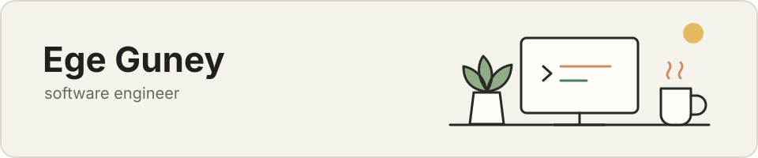

  

# Hi, I'm Ege.

I'm a software engineer based in Canada. I like taking things apart, understanding how they work, and building my own version—from a small file system in C to physics experiments in Unity and language-model apps on the web.

Most of the projects here started with a question I wanted to answer: *Could I turn roller-coaster track data into a rideable simulation? What does a file system look like underneath its API? How much of a physics engine can I build myself?*

I learn best by building, and I try to leave each project understandable for the next person who opens it.

## A few projects I've enjoyed building

### [Persona Studio](https://github.com/Ege-Guney/PersonaGPT-Web)

A web app for conversations with different AI personas. I recently rebuilt it with a cleaner interface, session-aware conversations, JSON APIs, lazy model loading, tests, and production packaging.

`Python` · `Flask` · `PyTorch` · `Transformers`

### [Roller Coaster Visualizer](https://github.com/Ege-Guney/RollerCoaster-Simulator)

A tool that reads RollerCoaster Tycoon 2-style track data and recreates the ride as a Unity spline. This was a fun mix of data parsing, coordinate systems, procedural construction, and animation.

`C#` · `Unity` · `Splines`

### [Simple File System](https://github.com/Ege-Guney/File-System-Project)

A persistent, single-directory file system built over an emulated block device. It includes inodes, bitmap allocation, direct and indirect addressing, file descriptors, and disk persistence.

`C` · `POSIX` · `Systems programming`

### [StickFish Physics Engine](https://github.com/Ege-Guney/StickFish-PhysicsEngine)

A Unity experiment where I implemented projectile motion, collision response, lifetime rules, and deformable line-rendered bodies instead of relying entirely on the built-in physics system.

`C#` · `Unity` · `Physics`

## Other things in here

- A [small C shell](https://github.com/Ege-Guney/Shell-Script-C) with pipes, redirection, signals, and background jobs
- A [React game hub](https://github.com/Ege-Guney/SmallGameHub) with four small browser games
- A [sentiment-analysis experiment](https://github.com/Ege-Guney/SentimentPredictor) comparing a web demo with an LSTM model
- A few earlier Unity, React, and C++ projects that show where I started

I work mostly with **C, C++, C#, Python, and JavaScript**, along with tools such as **Unity, React, Flask, and PyTorch**. The tools change from project to project; the part I enjoy is finding the right model for the problem and making the result easy to understand.

If something here catches your interest, feel free to [connect with me on LinkedIn](https://www.linkedin.com/in/egeguney).
